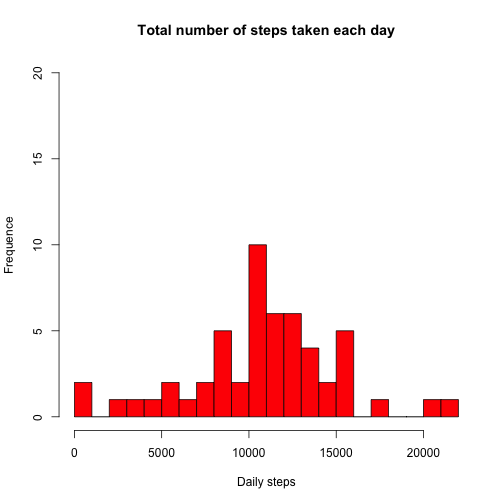
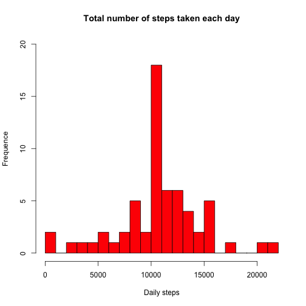
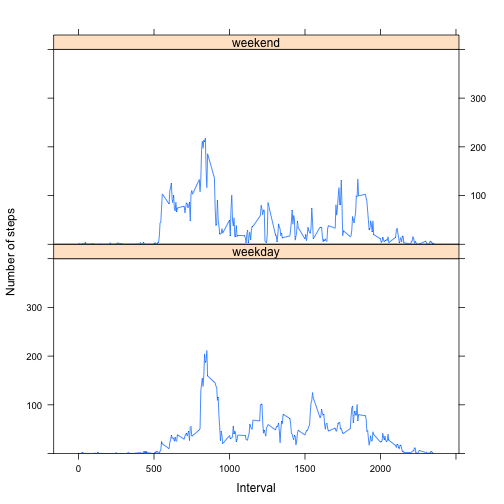

## Loading and preprocessing the data


```r
setwd("~/Desktop/RepData_PeerAssessment1/")
unzip("activity.zip")
my_data <- read.csv("activity.csv", sep=",")

dates <- as.Date(my_data$date, format = "%Y-%m-%d")
my_data$date <- dates
```

## What is mean total number of steps taken per day?


```r
not_na_my_data <- my_data[!is.na(my_data),]
sum_by_date<- aggregate(steps ~ date, data=not_na_my_data, FUN=sum)

# 1 - Make a histogram of the total number of steps taken each day
hist(sum_by_date$steps, main="Total number of steps taken each day", xlab="Daily steps", ylab="Frequence", col="red", breaks=20, ylim=(c(0, 20)))
```

 

```r
# 2 - Calculate and report the mean and median total number of steps taken per day
median_1 <- median(sum_by_date$steps)
mean_1 <- mean(sum_by_date$steps)
specify_decimal <- function(x, k) format(round(x, k), nsmall=k)
```

The **median** of the total number of steps taken per day is 10765.0 and the **mean** is 10766.2


## What is the average daily activity pattern?


```r
# 1 - Make a time series plot (i.e. type = "l") of the 5-minute interval (x-axis) and the average number of steps taken, averaged across all days (y-axis)
average_steps_by_interval <- aggregate(steps ~ interval, not_na_my_data, FUN=mean)
plot(average_steps_by_interval, type="l", xlab ="Interval", ylab="Average of steps")
```

 

```r
# 2 - Which 5-minute interval, on average across all the days in the dataset, contains the maximum number of steps?
index <- which.max(average_steps_by_interval$steps)
interval_max <- average_steps_by_interval$interval[index]
```

The 5-minute interval which contains the maximum number of steps is one with id: 835

## Imputing missing values

```r
# 1 - Calculate and report the total number of missing values in the dataset (i.e. the total number of rows with NAs)
n_mis <- nrow(my_data[is.na(my_data),])
n_mis2 <- sum(!complete.cases(my_data))
```

The number of rows with missing values is 2304


```r
# 2 - Devise a strategy for filling in all of the missing values in the dataset. The strategy does not need to be sophisticated. For example, you could use the mean/median for that day, or the mean for that 5-minute interval, etc.

my_data_na <- my_data[is.na(my_data),]
na_merged_data <- merge(my_data_na[,c("interval", "date")], average_steps_by_interval, by="interval")

# 3 - Create a new dataset that is equal to the original dataset but with the missing data filled in.
v_column_names <- c("steps", "date", "interval");
new_data <- rbind(not_na_my_data[, v_column_names], na_merged_data[, v_column_names])
```


```r
# 4 - Make a histogram of the total number of steps taken each day and Calculate and report the mean and median total number of steps taken per day. Do these values differ from the estimates from the first part of the assignment? What is the impact of imputing missing data on the estimates of the total daily number of steps?
sum_by_date2<- aggregate(steps ~ date, data=new_data, FUN=sum)
hist(sum_by_date2$steps, main="Total number of steps taken each day", xlab="Daily steps", ylab="Frequence", col="red", breaks=20, ylim=(c(0, 20)))
```

 

```r
median_2 <- median(sum_by_date2$steps)
mean_2 <- mean(sum_by_date2$steps)
```

We can observe that the removal of the missing values changes the frequence of appearance of just the mean of the daily steps while the other daily steps do not seem to be affected by any changes.  
This is because we have given the average number of steps per interval across the days to replace the missing values.

The **median** of the total number of steps taken per day considering the replacement of missing values is 10766.2 and the **mean** is 10766.2

## Are there differences in activity patterns between weekdays and weekends?


```r
# 1 - Create a new factor variable in the dataset with two levels – “weekday” and “weekend” indicating whether a given date is a weekday or weekend day.
new_data$weekdaytype = as.factor(weekdays(new_data$date))
levels(new_data$weekdaytype) = c("weekday", "weekday", "weekday", "weekday", "weekday", "weekend", "weekend")
# 2- Make a panel plot containing a time series plot (i.e. type = "l") of the 5-minute interval (x-axis) and the average number of steps taken, averaged across all weekday days or weekend days (y-axis). See the README file in the GitHub repository to see an example of what this plot should look like using simulated data.
avs_weekday <- aggregate(steps ~ interval , new_data[new_data$weekdaytype=="weekday",], FUN=mean)
avs_weekend <- aggregate(steps ~ interval , new_data[new_data$weekdaytype=="weekend",], FUN=mean)
library("lattice")
xyplot(steps ~ interval | weekdaytype, data=new_data, layout=c(1,2), type="a", ylim = c(0,400), xlab="Interval", ylab="Number of steps")
```

 

The data shows that there is a bigger number of steps during the weekend and that they are more distributed than during the weekdays.

